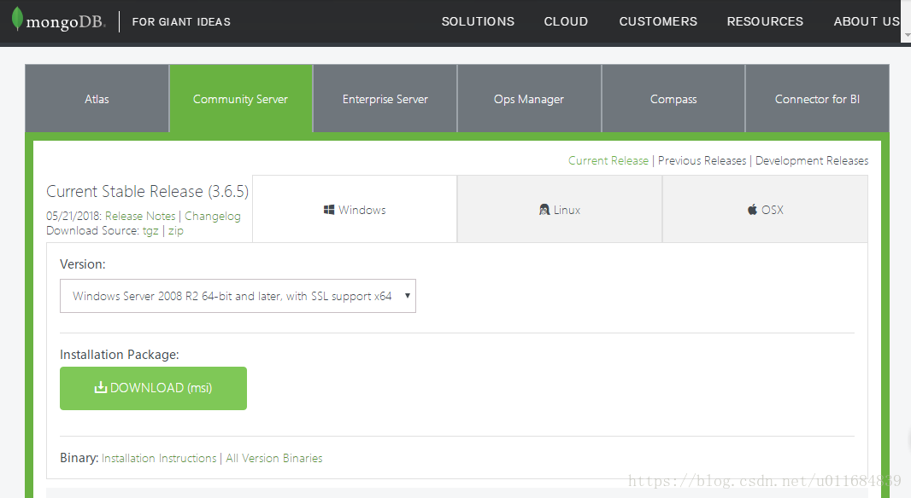

# window下MongoDB和Robomongo的安装配置与简单实战
=========
## MongoDB
--------

### 下载地址


[官网传送门](https://www.mongodb.com/download-center#community)（选择适合的环境和版本，点击之后跳转到另外一注册页，请耐心等待5s左右就会跳出下载框）

[云盘快捷传送门](https://pan.baidu.com/s/1Y5uTvTT9rLlOrW9HnCMp7g)：
https://pan.baidu.com/s/1Y5uTvTT9rLlOrW9HnCMp7g 密码：1ycs

### 安装

解压安装包，选择自定义“Custom”修改安装路径为`D:\Program Files\MongoDB`，然后点击Next直到安装结束。



### 配置


**3-1、创建数据库文件存放位置**
新建MongoDB的子文件夹data，再新建data的子文件夹db
D:\Program Files\MongoDB\data\db

**3-2、启动服务**
启动cmd，进入D:\Program Files\MongoDB\bin目录，输入

```
mongod --dbpath D:\Program Files\MongoDB\data\db
```

打开浏览器http://localhost:27017查看是否启动成功，成功如下图


**3-3、新建存放日志文件的文件夹**
新建data的子文件夹log   
`D:\Program Files\MongoDB\data\log`

**3-4、配置mongo.config文件**

新建mongo.config文件

打开文件输入文本如下：

```
dbpath=D:\Program Files\MongoDB\data\db
logpath=D:\Program Files\MongoDB\data\log\mongo.log
```
**3-5、配置windows服务**
mongod 命令需要配置环境变量：电脑右击→属性→高级系统设置→环境变量→系统变量PATH(或者path)新增→加入D:\Program Files\MongoDB\bin。

管理员身份启动cmd，进入`D:\Program Files\MongoDB\bin`目录，输入

```
mongod --config "D:\Program Files\MongoDB\mongo.config" --install --serviceName "MongoDB"
```
完成后打开服务，之后可使用net start MongoDB来启动mongodb


**3-6、报错问题整合**

1. 卸载重装后报错`发生系统错误2 系统找不到指定的文件`？
①、控制面板-管理工具-服务，打开mongoDB服务(根据你上次定义的名字查找)
②、SC DELETE mongoDB
③、`mongod --config "D:\Program Files\MongoDB\mongo.config" --install --serviceName "MongoDB"`

2. 端口被占用？
[失败原因之一端口被占用→传送门]


### 设置auth认证/权限（可选）

mongo默认是没有密码可进去，如果需要设置用户名和密码的话需要进行三个步骤：
①、创建管理员
②、授权认证
③、给使用的数据库添加用户

C:\WINDOWS\system32>mongo//打开cmd输入mongo开启服务

```
//使用admin数据库
> use admin 
	switched to db admin
//添加用户名和密码
> db.createUser({user:"admin",pwd:"admin",roles:["root"]})
	Successfully added user: { "user" : "admin", "roles" : [ "root" ] }
//登录认证
> db.auth("admin","admin")
	1
//新建 test数据库
> use test
	switched to db test
//添加用户权限和角色
> db.createUser({user:'root',pwd:'123456',roles:[{role:'dbOwner',db:'test'}]})
	Successfully added user: {
	        "user" : "root",
	        "roles" : [
	                {
	                        "role" : "dbOwner",
	                        "db" : "test"
	                }
	        ]
	}
> mongod --config "D:\Program Files\MongoDB\mongo.config" --auth
	2018-07-03T16:13:24.477+0800 E QUERY    [thread1] SyntaxError: missing ; before statement @(shell):1:9
```

## Robomongo
=========

Robomongo又名robo.3t，试过mongo的数据库中算是最好的，另外studio.3t也不错。自带的compass经常会打不开可能被我安全管家吞文件了；mongoVue在mongo3版本以上表现不佳，频频出错。

### 下载地址
--------


[云盘快捷传送门→robo.3t.windows-x86_64.7z](https://pan.baidu.com/s/1Y5uTvTT9rLlOrW9HnCMp7g)：
https://pan.baidu.com/s/1Y5uTvTT9rLlOrW9HnCMp7g 密码：1ycs
（备注：想下载studio.3t的请选择studioxsdaw.rar）

### 安装
------

按照步骤选择合适路径进行安装


## 简单使用
=========

MongoDB是非关系型数据库，与关系型数据库SQL、Oracle、Mysql有着很大的区别。关系型数据库通过外键关联来建立表与表之间的关系，而非关系型数据库通常指数据以对象的形式存储在数据库中，而对象之间的关系通过每个对象自身的属性来决定。

**3-1、非关系型数据库和关系型数据库区别**

通过表格来区别两种数据库类型的术语概念

```html
<table>
    <thead>
        <tr>
            <th>sql术语/概念</th>
            <th>MongoDB术语/概念</th>
            <th>解释/说明</th>
        </tr>
    </thead>
    <tbody>
        <tr>
            <td>database</td>
             <td>database</td>
            <td>数据库</td>
        </tr>
        <tr>
            <td>table</td>
            <td>collection</td>
            <td>数据库表/集合</td>
        </tr>
        <tr>
            <td>row</td>
             <td>document</td>
            <td>数据记录行/文档</td>
        </tr>
        <tr>
            <td>column</td>
            <td>field</td>
            <td>数据字段/域</td>
        </tr>  

<tr>
            <td>index</td>
            <td>index</td>
            <td> 索引</td>
        </tr>  
        <tr>
            <td>table joins</td>
            <td>-</td>
            <td> 表连接，mongoDB不支持</td>
        </tr> 
        <tr>
            <td>primary key</td>
             <td>primary key</td>
            <td> 主键，MongoDB自动将 _id字段设置为主键</td>
        </tr>
        </tbody>
</table>
```


**3-2、基础实战**

对于数据来说无疑就是“增删改查”。下面通过实战的例子来熟悉基本命令操作，可直接控制台查询结果也可在可视化工具里面进行查看变化。

```bash
mongo //进入数据库

//展示所有数据库
> show dbs
admin  0.000GB
local  0.000GB

//新建一个数据库名字
> use demo 
switched to db demo

//此时demo为空所以查找时不显示
> show dbs
admin  0.000GB
local  0.000GB

//新建表第一种方法
> db.user.insert({id:1})
WriteResult({ "nInserted" : 1 })

//新建表第二种方法
> db.createCollection("users")
{ "ok" : 1 }

//显示表格，此时就有user和users两个表格
> show collections
user
users

//删除user表格
> db.user.drop()
true

//新增表格数据
> db.user.insert({userId:101,userName:'ct',userAge:'24',place:{province:'福建',city:'厦门'}})
WriteResult({ "nInserted" : 1 })

> db.user.insert({userId:102,userName:'qt',userAge:'26',place:{province:'广东',city:'深圳'}})
WriteResult({ "nInserted" : 1 })

//查找全部数据
> db.user.find()
{ "_id" : ObjectId("5b3c7d45a4af2175cb184b96"), "userId" : 101, "userName" : "ct", "userAge" : "24", "place" : { "province" : "福建", "city" : "厦门" } }
{ "_id" : ObjectId("5b3c7d56a4af2175cb184b97"), "userId" : 102, "userName" : "qt", "userAge" : "26", "place" : { "province" : "广东", "city" : "深圳" } }


//查找userName为ct的数据
> db.user.find({userName:'ct'})
{ "_id" : ObjectId("5b3c7d45a4af2175cb184b96"), "userId" : 101, "userName" : "ct", "userAge" : "24", "place" : { "province" : "福建", "city" : "厦门" } }


//查找userAge为大于20的数据
//$gt大于;$lt小于;$gte大于等于;$lte小于等于;$eq等于
> db.user.find({userAge:{$gt:"24"}})
{ "_id" : ObjectId("5b3c7d56a4af2175cb184b97"), "userId" : 102, "userName" : "qt", "userAge" : "26", "place" : { "province" : "广东", "city" : "深圳" } }

//查找第一条数据
> db.user.findOne()
{ "_id" : ObjectId("5b3c348f03c085f8633d1c4f"), "userId" : 101, "userName" : "ct", "userAge" : "24", "place" : { "province" : "福建", "city" : "厦门" } }

//查找第一条数据并格式化.pretty()
> db.user.findOne().pretty()
{
        "_id" : ObjectId("5b3c348f03c085f8633d1c4f"),
        "userId" : 101,
        "userName" : "ct",
        "userAge" : "24",
        "place" : {
                "province" : "福建",
                "city" : "厦门"
        }
}

//将userName为ct的userAge属性改成18，使用$set
> db.user.update({userName:'ct'},{$set:{userAge:18}})
WriteResult({ "nMatched" : 1, "nUpserted" : 0, "nModified" : 1 })

//将userName为ct的place属性的city属性改成漳州，注意place.city要用单引号引起来
> db.user.update({userName:'ct'},{$set:{'place.city':'漳州'}})
WriteResult({ "nMatched" : 1, "nUpserted" : 0, "nModified" : 1 })

//删除userId属性为101的数据
> db.user.remove({userId:101})

//删除整个数据库
> db.dropDatabase()
```

